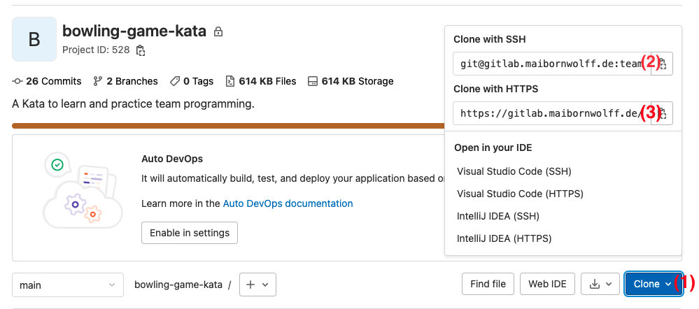
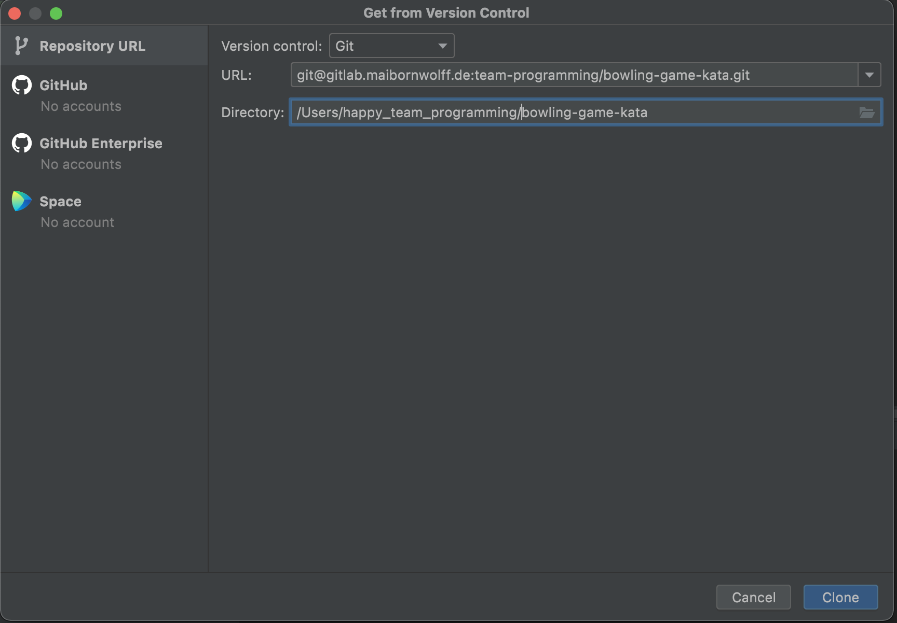
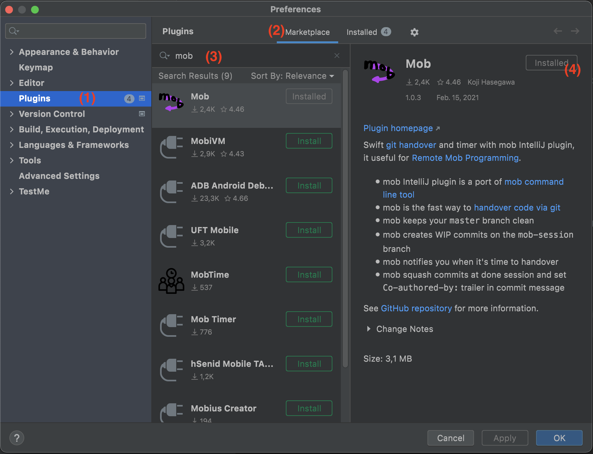

# Setting up the teams
Please form teams between 3 and 6 people.
There are no special requirements for how the teams should be formed.
Afterwards please make sure in the team that everybody in the team has a working setup 

# The tech-setup
- Zoom
  - [download link](https://zoom.us/download)
- GIT
- Intellij
  - [download link](https://www.jetbrains.com/de-de/idea/download/)
  - license server: https://license-jetbrains.maibornwolff.de
- Mob-Intellij
  - [download link](https://plugins.jetbrains.com/plugin/14266-mob)
- Java
  - min. Java 11 + SDK

## Checkout and import project
1. Go to the [repository](https://gitlab.maibornwolff.de/team-programming/bowling-game-kata)
2. Click the blue clone button (1) and copy the (2) "Clone with SSH"-URL (if you have an SSH-Key already added to gitlab) **or** (3) "Clone with HTTPS"-URL

3. Open Intellij and click "Open From VCS"
4. Use the copied link in the URL field, select a folder where you want to clone the repository to your local machine
   
5. Click "Clone" button
6. A new Window should open
7. Wait until all files are indexed by Intellij (progress is displayed in the lower right corner)

After the project is loaded by Intellij, you can navigate to `src/test/java/GameTest` and run the test via the green little arrow. If the test runs, but fails, you have successfully finished your setup :-)  

## Mob-Plugin
### Install
1. Open [Mob-Intellij-Plugin page](https://plugins.jetbrains.com/plugin/14266-mob) and click "Install to IntelliJ IDEA"

Alternatively, if this is not working, you can install this plugin also via Intellij-Plugin Window
1. Open Intellij
2. Click on "Intellij IDEA"
3. Select "Preferences..." and then Plugins (1)
4. In the "Marketplace"-Tab (2), search for "Mob" (3)
5. Click "Install" (4)

### Mob-Controls 
| Action | Where can I find this action? | What does this action? |
|---|---|---|
| Starting new session | Git -> Mob -> Start Mob Programming as Typist... | Pulls, create/switch to configured branch (default `mob-session`) and starts the timer (time is shown in the lower right corner)|
| Mob Next | Git -> Mob -> Next: Handover to next Typist... | Commits and pushes, so the next typist can start |
| Mob Done | Git -> Mob -> Done: Finish Mob Session... | Commits and pushes |

Preferences of this Plugin can be changes in "Preferences -> Tool -> Mob"

## Am I ready?
- bowling game checked out and imported into intellij
- code can be compiled
- first test can be run and fails
- i can start a new mob session with the mob-tool

## Watch and learn?
* a first example session (performed by the moderators) (10m)