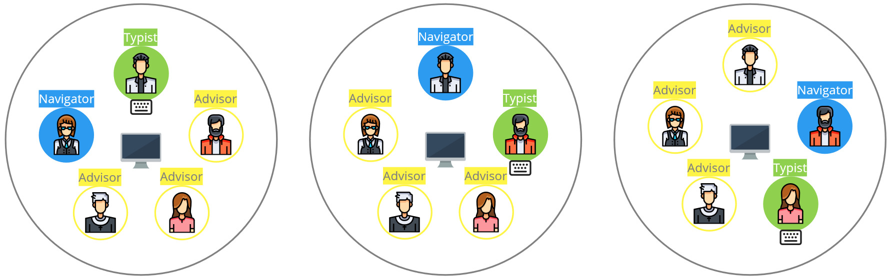

# What is Team Programming?

*At MaibornWolff, we use the term Team Programming instead of the original term Mob Programming, because mob has a negative conotation! In the copied content below we keep the original term.*

Remote Mob Programming combines two ways of working: Mob Programming and working as a distributed team. Woody Zuill describes Mob Programming as creating the “same thing, at the same time, in the same space, and on the same computer”. Working in the same space clashes with working as a distributed team at first glance, but actually, it goes together really well. With Remote Mob Programming, we collaborate closely in the same virtual space.

## Typist and the Rest of the Mob

We adopted the terminology from Code with the Wisdom of the Crowd by Mark Pearl:

One person controls the keyboard, this is the typist. The rest of the mob discusses the problem, agrees on the solution, and instructs the typist. The typist follows their instructions, puts them into code, and may ask clarifying questions to understand the solution. The rest of the mob guides the typist as needed.

*We value the typist as they allow the rest of the mob to focus on solving the problem.*

The typist must not code on their own. This balances the participation of all team members and it reduces the dominance of strong characters.

*At MaibornWolff use the so-called "strict mode" with a designated navigator as the default, he rest of the team acts as advisors. It is totally fine to use the non-strict mode without a designated navigator, or in other words, everybody except the typist is a navigator.*

## Screen Sharing

We feel most comfortable working in our own individual environment. It is where we are most productive.

The typist shares their primary screen, showing the IDE. It is a good practice to show the IDE fullscreen and disable notifications.

*We all look at the same shared screen.*

Looking at and working on the same issue forces us to focus. It is highly efficient to work with actual code in contrast to having abstract meta discussions.

We tried collaboration IDEs. Surprisingly, this led to worse collaboration. Impatient members of the rest of the mob circumvented both, the discussion and the typist, by just hacking their ideas.
While the typist shares the screen, the rest of the mob has no shortcuts. Only the typist types, the rest of the mob must explain what to do through language.

We accept the time to switch the shared screen at the start of the next mob interval.

## 10 Minute Intervals

Every mob session has a specific goal (e.g. to implement a feature or fix a bug) and may last several hours. In a mob session, the typist role rotates periodically. Short rotation periods keep everyone concentrated and every opinion in the mix.

*We rotate every ten minutes.*

We tried different rotation periods and considered ten minutes as a good trade-off. Shorter periods didn’t work out for us because of the inherent switching costs in a remote team.

Surprisingly, taking your turn as a typist allows you a mental relaxation. You just wait for instructions.

## Git Handover

With on-site Mob Programming, you just pass on the keyboard to hand over to the next person. This is a challenge for a distributed team.

*We hand over with WIP commits on a temporary git branch.*

To have a clean master branch, we work on a temporary mob-session branch. After each interval, we push a work in progress (WIP) commit to this branch. In this branch, we don’t care about the commit message, if the code compiles, or if the tests are green.

A quick handover is essential. At the end of the mob session, we squash the WIP commits into expressive commits and merge into master.

We use the mob tool to simplify this process.

## Group Decisions

In software engineering, you constantly compare different alternatives and decide for one. Reversing decisions is often expensive. Group decisions are superior over individual decisions. In Remote Mob Programming, all decisions are group decisions.

*We minimize technical debt.*

With our wealth of know-how, experience, and opinions to discuss, we are able to make well-founded decisions everyone agrees with. When we are coding, we all agree on changes and code style. As a consequence, we don’t need code reviews or pull requests.

## More

The content above was shamelessly borrowed from: https://www.remotemobprogramming.org/

Please find more details for doing Team Programming in your daily job there!
